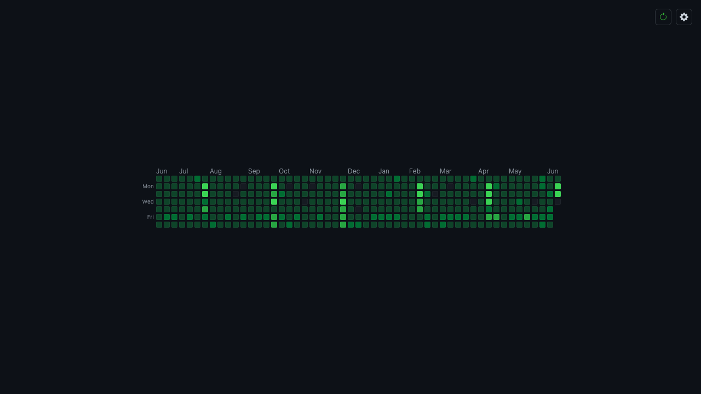

# GitHub Stats Tab

A minimal Chrome extension (Manifest V3) that turns every **new tab** into just a
pixel-faithful GitHub contribution heatmap for one username. **No login / no auth
token**: it scrapes the public profile.



## What it shows

- **Only the contribution heatmap** (5-level green squares, 7 rows × ~53 week
  columns, month + Mon/Wed/Fri labels), centered — rebuilt from GitHub's own data
  to match exactly. No avatar, name, or stat line.
- A small top-right cluster: a **refresh** button whose color encodes data age
  (gentle green when fresh → red at 1 day; auto-refreshes past 1 day) and a
  **settings** gear that opens a username popover right under it (no page reflow).

Set a username once in settings; results are cached for 24h with manual refresh.

## How it works (no token)

| Data | Source |
|------|--------|
| Heatmap + total contributions | `https://github.com/users/{username}/contributions` (HTML, parsed in `src/parse.js`; total = sum of per-day tooltip counts) |

That single HTML fragment is the only thing fetched. CORS is handled by the
manifest's lone `host_permissions` entry for `github.com`, so the new-tab page can
`fetch()` it directly — no token, no backend, no `api.github.com`. The endpoint is
**undocumented and can change**; parsing is isolated in `src/parse.js` and fails
loudly (error + retry on the page, and `test/parse.test.js` goes red against the
saved fixture).

## Stack

Vanilla HTML/CSS/JS ES modules. No build step. Node `node:test` for unit/parser
tests; Playwright for the loaded-extension E2E.

## Develop / install

```bash
npm install
npm test            # unit + parser tests (node:test)
npm run icons       # regenerate icons/ (only if you change the generator)
npm run test:e2e    # Playwright E2E: loads the unpacked extension, mocked GitHub
RUN_LIVE=1 npm run test:e2e   # also run the live real-endpoint smoke
```

**Load in Chrome:** `chrome://extensions` → enable Developer mode → **Load
unpacked** → select this folder. Open a new tab, click the gear, enter a username.

## Files

```
manifest.json          MV3: new-tab override, github.com host_permission, background SW
newtab.html            page shell → src/main.js
styles.css             GitHub-dark theme, centered layout
src/parse.js           contributions HTML → { days, total }   (pure, fixture-tested)
src/heatmap.js         buildGrid / monthLabels (pure) + renderHeatmap
src/cache.js           24h chrome.storage cache (isFresh pure)
src/freshness.js       data-age → refresh color + auto-refresh threshold (pure)
src/settings.js        username get/set + validation
src/github.js          fetch contributions (no auth)
src/main.js            orchestrator + empty/loading/ready/error states
src/background.js       minimal service worker
scripts/generate-icons.mjs   dependency-free PNG icon generator
test/                  node:test unit + parser + freshness tests (+ fixture)
e2e/                   Playwright loaded-extension tests
```

## Status / deferred

Feature-complete and verified (unit + E2E + live). Not yet done: published to the
Chrome Web Store. Future ideas: a popup surface, multiple saved usernames, streak
stats.
