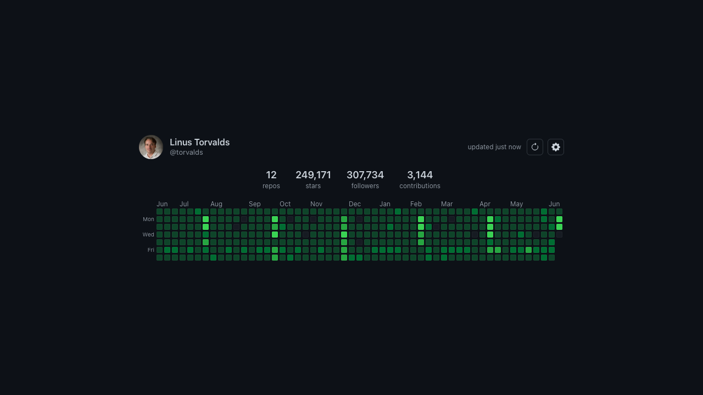

# GitHub Stats Tab

A minimal Chrome extension (Manifest V3) that turns every **new tab** into a
GitHub stats page for one username — the hero being a pixel-faithful contribution
heatmap. **No login / no auth token**: it scrapes the public profile.



## What it shows

- The contribution heatmap (5-level green squares, 7 rows × ~53 week columns,
  month + Mon/Wed/Fri labels) — rebuilt from GitHub's own data to match exactly.
- A slim stat line: public repos · stars · followers · total contributions.
- Avatar + name + `@username` (links to the profile), with **refresh** and
  **settings** (change username) controls.

Set a username once in settings; results are cached for 24h with a manual refresh.

## How it works (no token)

| Data | Source |
|------|--------|
| Heatmap + total contributions | `https://github.com/users/{username}/contributions` (HTML, parsed in `src/parse.js`; total = sum of per-day tooltip counts) |
| Avatar | `https://github.com/{username}.png` (image, no API) |
| Repos / followers | unauthenticated `https://api.github.com/users/{username}` (60 req/hr) |
| Total stars | sum of `stargazers_count` across `…/repos` pages (best-effort) |

CORS is handled by the manifest's `host_permissions` for `github.com` and
`api.github.com`, so the new-tab page can `fetch()` them directly — no token, no
backend. The contributions endpoint is **undocumented and can change**; parsing is
isolated in `src/parse.js` and fails loudly (the page shows an error + retry, and
`test/parse.test.js` goes red against the saved fixture).

## Stack

Vanilla HTML/CSS/JS ES modules. No build step. Node `node:test` for unit/parser
tests; Playwright for the loaded-extension E2E.

## Develop / install

```bash
npm install
npm test            # unit + parser tests (node:test)
npm run icons       # regenerate icons/ (only if you change the generator)
npm run test:e2e    # Playwright E2E: loads the unpacked extension, mocked GitHub
RUN_LIVE=1 npm run test:e2e   # also run the live real-endpoint smoke
```

**Load in Chrome:** `chrome://extensions` → enable Developer mode → **Load
unpacked** → select this folder. Open a new tab, click the gear, enter a username.

## Files

```
manifest.json          MV3: new-tab override, host_permissions, background SW
newtab.html            page shell → src/main.js
styles.css             GitHub-dark theme, centered layout
src/parse.js           contributions HTML → { days, total }   (pure, fixture-tested)
src/heatmap.js         buildGrid / monthLabels (pure) + renderHeatmap
src/cache.js           24h chrome.storage cache (isFresh pure)
src/settings.js        username get/set + validation
src/github.js          fetch contributions / profile / stars (no auth)
src/main.js            orchestrator + empty/loading/ready/error states
src/background.js       minimal service worker
scripts/generate-icons.mjs   dependency-free PNG icon generator
test/                  node:test unit + parser tests (+ fixture)
e2e/                   Playwright loaded-extension tests
```

## Status / deferred

v1 is feature-complete and verified (unit + E2E + live). Not yet done: published
to the Chrome Web Store. Future ideas: a popup surface, multiple saved usernames,
streak stats.
