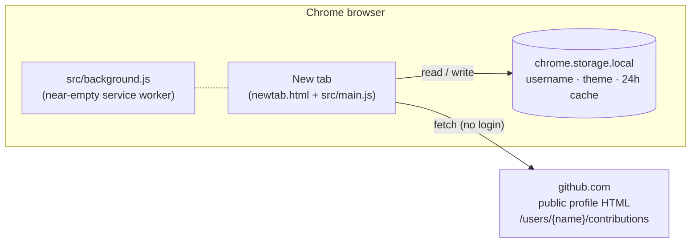
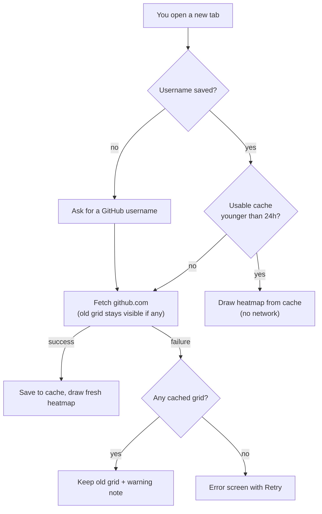
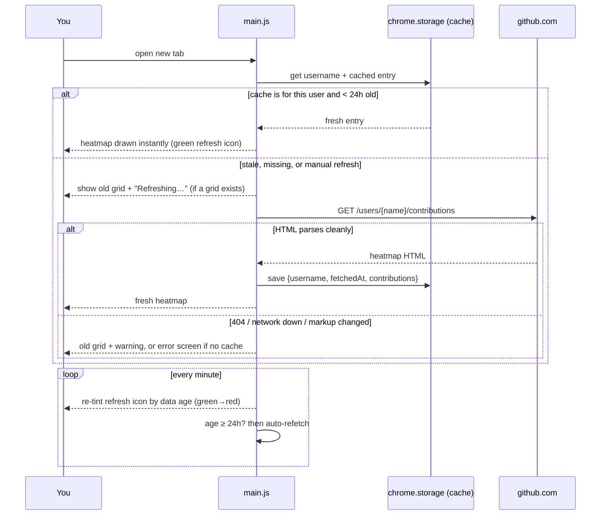

# How It Works

An architecture explainer for **Github Stats — New Tab**. It's written for a curious reader with no programming background; the technical terms that matter are explained the first time they appear.

## What it is

Github Stats — New Tab is a small add-on for the Chrome web browser. After you install it, every time you open a new empty tab, instead of Chrome's usual page you see a GitHub *contribution heatmap* — the grid of little green squares that shows how much someone coded each day for the past year. You type in one GitHub username once, and from then on that person's grid greets you on every new tab. It's for anyone who wants a daily nudge to keep their streak going (or just likes staring at green squares), and it works without logging in to anything.

## The pieces, from zero

**Chrome extension.** A Chrome extension is a small program you add to the Chrome browser to change how it behaves — like a custom Lego brick you snap onto the browser. It's just a folder of ordinary web files — HTML (a page's content), CSS (its looks), and JavaScript (its behavior) — plus one instruction file that tells Chrome what the folder does.

**Manifest V3 (MV3).** That instruction file is called `manifest.json` — the "manifest," like a shipping manifest that lists what's in a container. "V3" is simply the third version of the rules Chrome uses to read that file; it's the current standard all new extensions must follow. This project's manifest is `manifest.json` at the repo root, and it declares three important things:

1. **A new-tab override.** The line `"chrome_url_overrides": { "newtab": "newtab.html" }` tells Chrome: "when the user opens a new tab, don't show your default page — show my `newtab.html` instead." That one line is what makes this a new-tab extension.
2. **Permissions.** Extensions must ask up front for what they touch. This one asks for exactly two things: `"storage"` (a small private notepad where the extension can save your settings inside your browser) and permission to talk to `https://github.com/*` (any page on github.com). Nothing else — no reading your browsing history, no other websites.
3. **A background service worker.** A *service worker* is a script the browser can run in the background even when no page is open. Here (`src/background.js`) it is deliberately almost empty — 6 lines that do nothing. It exists only so the extension has a standard lifecycle hook if a future feature ever needs one. All the real work happens in the new-tab page itself.

**The new-tab page.** `newtab.html` is a nearly-blank HTML shell that loads one stylesheet (`styles.css`) and one JavaScript module (`src/main.js`). There is no build step — the files you see in the repo are exactly the files Chrome runs. `main.js` is the conductor: it reads your saved username, decides whether to use saved data or fetch fresh data, and draws one of four screens: *empty* (no username saved yet — asks for one), *loading*, *ready* (the heatmap), or *error*.


Notice: there is no server of ours anywhere — every fetch the extension makes on its own goes to github.com, and everything it remembers lives inside your own browser.

## Where the data comes from (the no-login trick)

GitHub shows everyone's contribution heatmap publicly on their profile page. Behind the scenes, the grid on that page is loaded from one address:

```
https://github.com/users/{username}/contributions
```

Open that in a browser and you get a fragment of HTML — the raw text markup of just the heatmap. Because it's the same thing any logged-out visitor can see, **no password, account, or API key is needed**. (An *API key* is a secret code apps normally use to prove who they are to a service; skipping it means there's nothing to sign up for and nothing secret to leak.)

`src/github.js` fetches that address and hands the HTML to `src/parse.js`, which digs out two things for each of the ~365 days:

- the **date** and a **level** from 0 to 4 — GitHub's own "how green should this square be" rating, read straight from each cell's attributes;
- the exact **count** ("2 contributions on June 15th"), read from the tooltip text GitHub attaches to each cell.

The parser then rebuilds the grid from scratch (`src/heatmap.js`) instead of pasting GitHub's HTML into the page, so the extension fully controls colors, spacing, and theming.

**One catch, handled deliberately:** that address is *undocumented* — GitHub publishes no promise about it, and could change its markup any day. So the parser is built to **fail loudly**: if it finds no grid cells at all, or more than half the per-day tooltips have vanished, it stops with an error instead of guessing (`src/parse.js:19` and `src/parse.js:50`) — you see an error message on the page rather than a silently wrong grid. (It's a tripwire, not a guarantee: a subtler change, like GitHub rewording tooltip text, could still slip past as zero counts.) A test in `test/parse.test.js` runs the parser against a saved copy of GitHub's markup, pinning down exactly what format the parser understands.

**Why doesn't the browser block this cross-site request?** Normally a web page is not allowed to fetch content from a different website and read it — a browser safety rule called *CORS* (Cross-Origin Resource Sharing, roughly: "site A may not read site B's mail unless B says it's okay"). Extensions get an exception: because the manifest explicitly declares `host_permissions` for `https://github.com/*`, and you approved that at install time, Chrome lets the extension's pages fetch github.com directly. That single permission line is what makes the whole no-login approach possible.

## Caching and the color-coded refresh button

Fetching GitHub on *every* new tab would be slow and rude (people open a lot of tabs). So the extension keeps a **cache** — a saved copy of the last successful fetch, stored in the browser's `chrome.storage.local` notepad along with when it was fetched (`src/cache.js`).

The rules, in order (`src/main.js`, `load()`):

1. No saved username → show the "enter a username" screen.
2. Read the cache. A cached entry is only trusted if it's for the *current* username and has the expected shape; anything else (say, leftovers from an old version) is deleted, not rendered (`src/cache.js`, `isUsableEntry`).
3. Cache exists and is **less than 24 hours old** → render it instantly. No network at all. This is the common case: most new tabs cost zero requests.
4. Cache is missing or older than 24 hours (or you clicked refresh) → fetch fresh HTML. While fetching, if there's *any* usable cached grid it stays on screen with a small "Refreshing…" note, so you never watch a spinner when old data would do.
5. Fetch succeeded → save it as the new cache and render. Fetch failed → if a cached grid exists, keep showing it with a warning ("Showing cached data — couldn't refresh"); only with no cache at all do you get a full error screen with a Retry button.

**Staleness is visible, not hidden.** The refresh button in the top-right corner is tinted by how old the on-screen data is (`src/freshness.js`): pure green at up to 10 minutes old, then sliding smoothly through yellow and orange to red at 24 hours. A timer ticks once a minute to update the color, and once data crosses the 24-hour line — even on a tab you've left open all day — it auto-refreshes (`src/main.js:352-355`). When the refresh succeeds, red is only a momentary flash before the icon snaps back to green; if it fails (say, you're offline), the old grid stays up, the icon stays red, and the timer retries every minute until a refresh succeeds.


Notice: the happy path (cache hit) never touches the network — in normal use GitHub sees about one request per day per open tab, though a failing refresh retries once a minute until it succeeds.


Notice: a failed refresh never wipes the cached grid — it downgrades to "old grid plus a warning" — and the once-a-minute loop is what turns the icon red and triggers the auto-refresh.

## Theming

The settings gear offers **Light / Dark / System**. Your choice is saved in the same browser storage (`src/settings.js`). "System" means "follow the computer's light/dark mode," and the page listens for the operating system flipping modes so it updates live (`src/main.js`, `applyTheme`). The heatmap squares themselves are colored purely by CSS rules keyed to each cell's level (`styles.css`), so switching theme recolors the whole grid instantly without redrawing anything.

## Why it's built this way

- **No-auth HTML scraping instead of GitHub's official API.** The official API needs a token for reasonable rate limits, which means account setup, secret storage, and a scary permission ask. Reading the public page needs none of that — the trade-off (undocumented markup can change) is contained in one loudly-failing parser file.
- **No server, no build step, vanilla JavaScript.** The whole app is ~640 lines of JavaScript across 8 files (plus one HTML shell and one stylesheet). A backend or a bundler would add moving parts with nothing to gain at this size; the folder you download is exactly the folder Chrome runs.
- **24-hour cache with visible age.** For a glance-at-your-streak page, a day-old grid is almost always good enough, so a day-long cache makes almost every new tab instant with near-zero traffic to GitHub — and the color-coded button means the cache never silently lies to you about freshness.
- **Own grid renderer instead of injecting GitHub's HTML.** Rebuilding the grid from parsed data keeps GitHub's page styles and scripts out, and makes theming a pure-CSS switch.
- **Load-unpacked distribution.** The extension isn't on the Chrome Web Store, so installing it means pointing Chrome at the source folder directly (steps below). For an open-source tool this is zero-cost and transparent: you can read every line you're about to run, and there's no store-review delay between a fix landing and you having it. (Web Store listing assets exist in the repo, so a store release may follow.)

## Installing it (load unpacked)

"Load unpacked" is Chrome's developer-oriented way to install an extension straight from a folder instead of from the Web Store.

1. Download (or `git clone`) this repository: `https://github.com/wizdes/GitHubStatsTab`.
2. In Chrome, go to `chrome://extensions` and switch on **Developer mode** (toggle in the top-right corner).
3. Click **Load unpacked** and select the project folder (the one containing `manifest.json`).
4. Open a new tab — it asks for a GitHub username right there. Type one and press Show. (Later, the gear icon in the top-right corner lets you change the username or theme.)

The project is public and open source under the **MIT license** (see `LICENSE`) — you're free to use, modify, and share it. Privacy-wise there is nothing to collect: no accounts, no tracking, and the only network request it ever makes on its own is to github.com for the public profile grid (the settings panel does contain an ordinary "Learn more" link you can click) (see `PRIVACY.md`).
